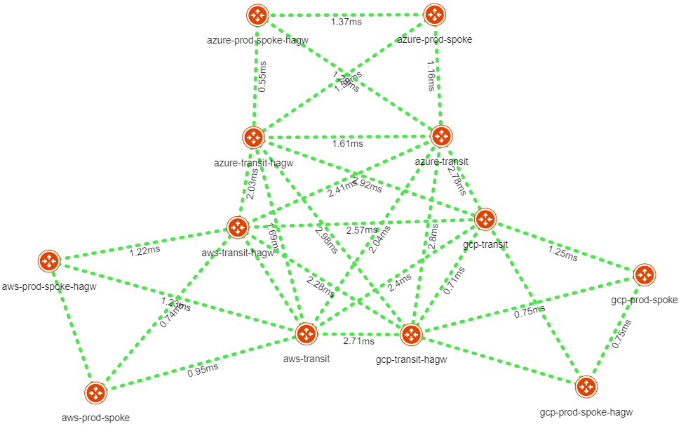

# Aviatrix MCNA

This repository provides a Terraform implementation that deploys a single region Aviatrix Multi-Cloud Networking Architecture using Aviatrix modules across AWS, Azure and GCP.

The code provided is for demo purposes only.



## Prerequisites

Please make sure you have:
- Aviatrix Controller 6.6
- AWS, Azure, and GCP access accounts are onboarded. 

## Environment Variables

To run this project, you will need to set the following environment variables

Variables | Description
--- | ---
AVIATRIX_CONTROLLER_IP | Aviatrix Controller IP or FQDN 
AVIATRIX_USERNAME | Aviatrix Controller Username
AVIATRIX_PASSWORD | Aviatrix Controller Password
TF_VAR_aws_account | AWS Aviatrix Account 
TF_VAR_azure_account | Azure Aviatrix Account
TF_VAR_gcp_account | GCP Aviatrix Account

## Run Locally

Clone the project

```bash
git clone https://github.com/bayupw/terraform-aviatrix-mcna-demo
```

Go to the project directory

```bash
cd terraform-aviatrix-mcna-demo
```

Set environment variables

```bash
export AVIATRIX_CONTROLLER_IP="aviatrixcontroller.aviatrix.lab"
export AVIATRIX_USERNAME="admin"
export AVIATRIX_PASSWORD="aviatrix123"
export TF_VAR_aws_account="aws-Aviatrix-Account"
export TF_VAR_azure_account="azure-Aviatrix-Account"
export TF_VAR_gcp_account="gcp-Aviatrix-Account"
```

Terraform workflow

```bash
terraform init
terraform plan
terraform apply -auto-approve
```

## Inputs

| Name | Description | Default | Required |
|------|-------------|---------|----------|
| global_supernet | CIDR for the overall supernet | `10.0.0.0/8` | no |
| aws_account | AWS Account for Aviatrix Controller | `null` | yes |
| azure_account | Azure Account for Aviatrix Controller | `null` | yes |
| gcp_account | GCP Account for Aviatrix Controller | `null` | yes |
| aws_region | AWS Region | `ap-southeast-2` | no |
| azure_region | Azure Region | `Australia East` | no |
| gcp_region | GCP Region | `australia-southeast1` | no |
| aws_instance_size | AWS gateway instance size | `t2.micro` | no |
| azure_instance_size | Azure gateway instance size | `Standard_B1ms` | no |
| gcp_instance_size | GCP gateway instance size | `n1-standard-1` | no |
| hpe | Insane mode flag | `false` | no |
| ha_gw | Enable HA gateway | `true` | no |
| enable_segmentation | Enable segmentation | `false` | no |